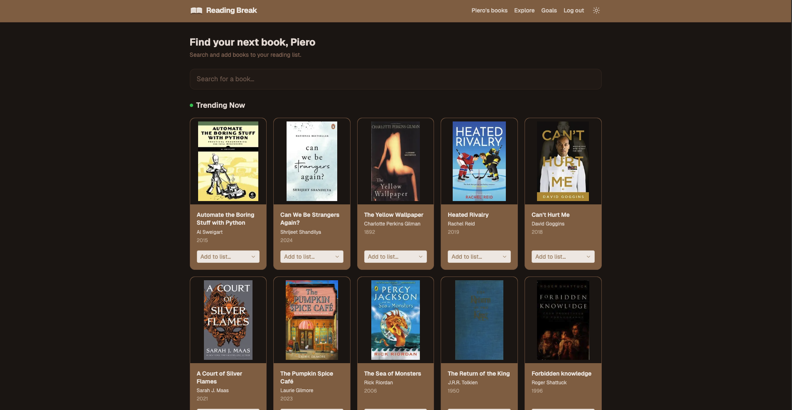
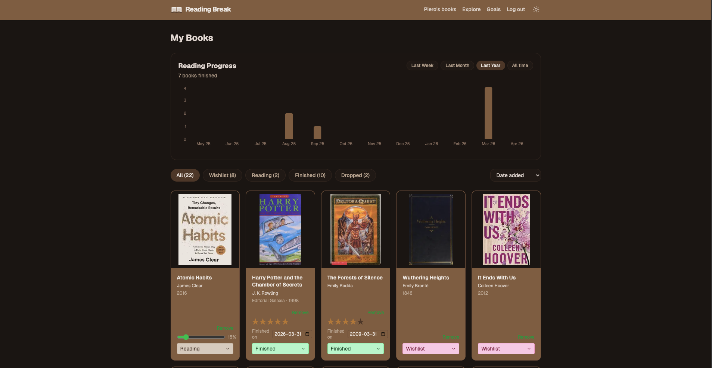
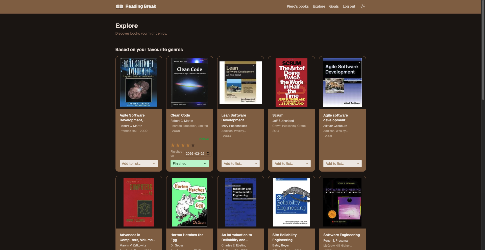
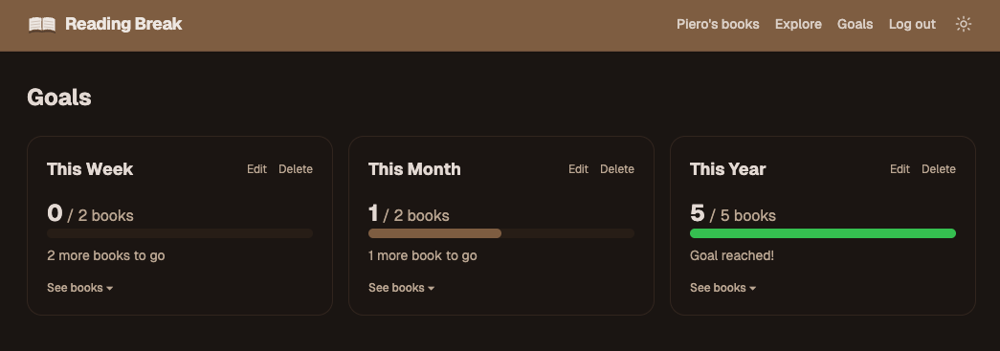

# Reading Break

A personal book tracking app.

**Live demo:** http://54.71.112.27:3000/ — deployed on **AWS EC2**

## Screenshots

<table>
  <tr>
    <td></td>
    <td></td>
  </tr>
  <tr>
    <td></td>
    <td></td>
  </tr>
</table>

## Stack

| Layer     | Technology                                                                               |
| --------- | ---------------------------------------------------------------------------------------- |
| Framework | **Next.js 16** (App Router) + **TypeScript**                                             |
| Styling   | **Tailwind CSS v4**                                                                      |
| Database  | **better-sqlite3** — local SQLite, auto-created as `data.db` on first run, no migrations |
| Book data | **Open Library API** — free, no API key required                                         |

## Getting Started

```bash
npm install
npm run dev   # http://localhost:3000
```

No environment variables needed.

## What You Can Do

### Home
- Search for any book via Open Library (debounced, min 2 chars)
- Add a result to your collection with a status: Wishlist, Reading, Finished, or Dropped

### My Books
- Filter your collection by status (All / Wishlist / Reading / Finished / Dropped)
- Sort by date added, title, author, or highest rating
- Browse paginated results (20 books per page)
- Change a book's status via dropdown
- Set a rating, reading progress (%), and finished date
- Remove a book from your collection

### Explore
- Get personalized recommendations based on books you're reading or have finished
- Browse by genre (Fiction, Mystery, Sci-Fi, History, Biography, Fantasy, Romance, Self-Help, Thriller, Philosophy)
- Discover more books by authors already in your collection

### Goals
- Set weekly, monthly, or yearly reading goals
- Track progress with a visual progress bar
- See which books count toward each goal period
- Edit or delete goals at any time

### Account
- Sign up and log in with email + password
- Sessions persist for 30 days
- Log out from any page

### UI
- Light / dark mode toggle

## Project Structure

```
src/
├── app/                # Next.js App Router pages and API routes
│   ├── api/            # Internal API endpoints
│   └── my-books/       # My Books page
├── components/         # Shared React components
├── hooks/              # Custom hooks (e.g. useDebounce, useSearch)
└── lib/                # Database client and utility functions
```

## Open Library API

The app uses the [Open Library API](https://openlibrary.org/developers/api) — completely free, no account or API key needed.
